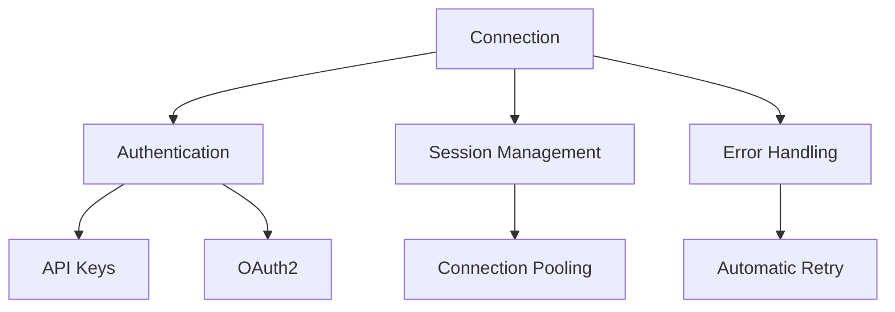
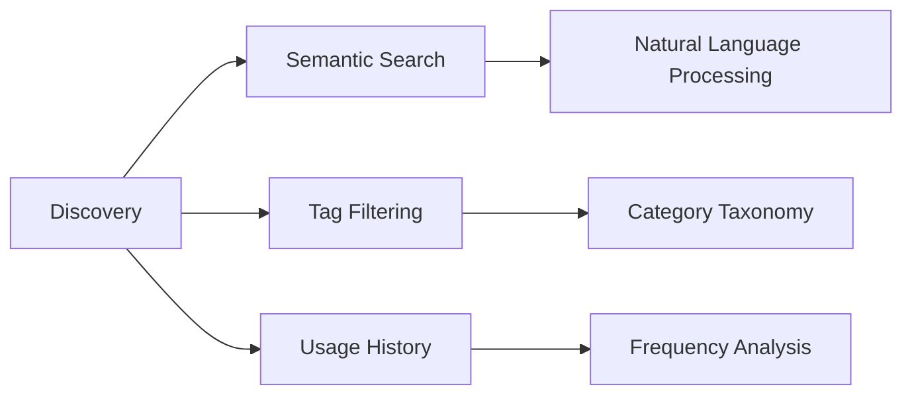
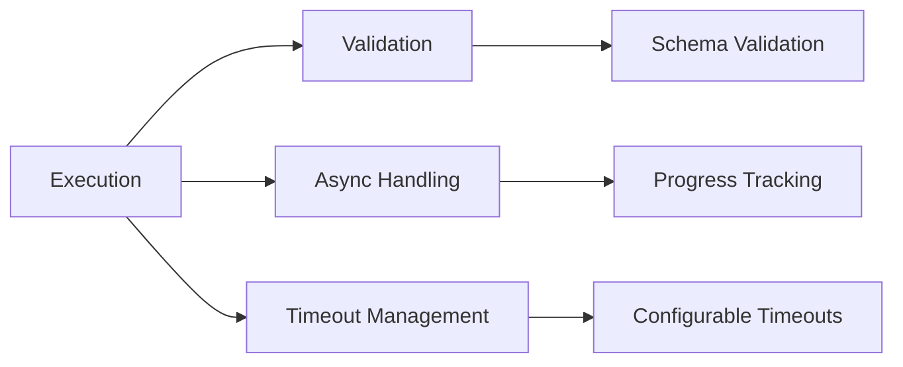
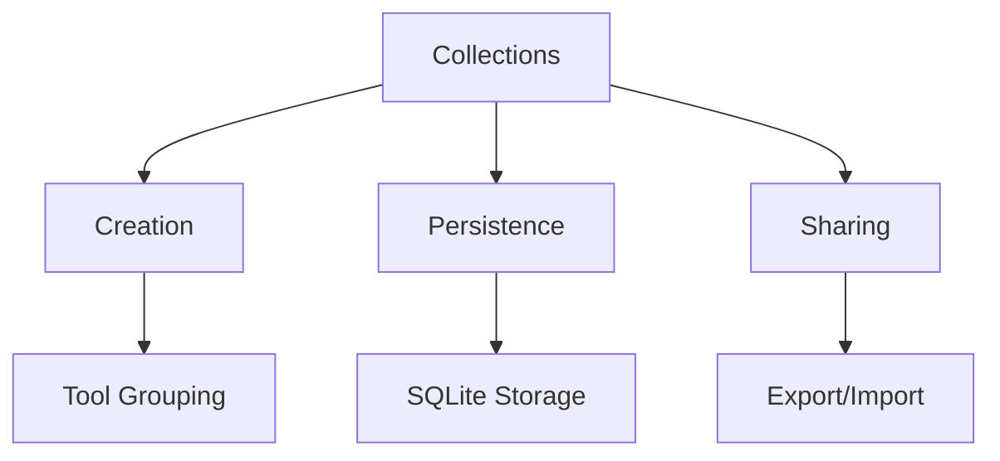
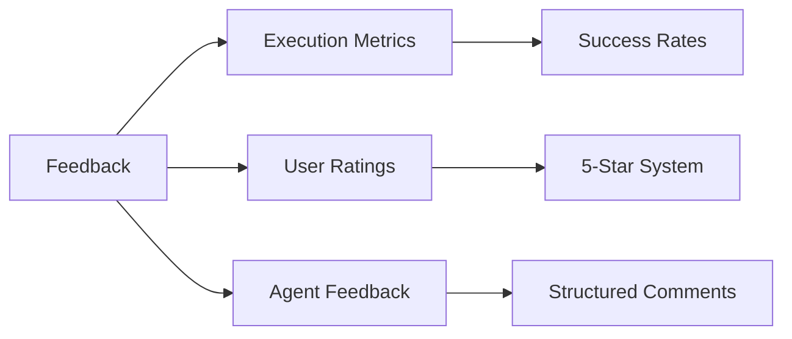
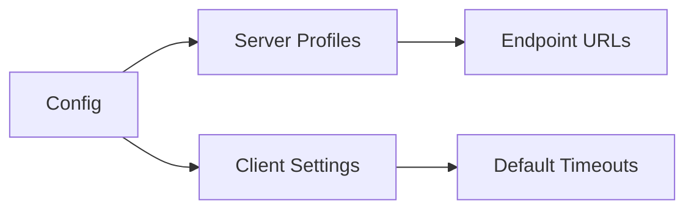

# MCP Client Requirements Specification

## Overview
The MCP Client is designed to enable AI Agents to discover, manage, and execute tools from MCP servers with intelligent feedback and collection management.

## 1. Core Connection Management

### Requirements
- **MCP-CLIENT-FR-001**: Support multiple authentication methods (API keys, OAuth2)
- **MCP-CLIENT-FR-002**: Implement connection pooling for efficiency
- **MCP-CLIENT-FR-003**: Automatic retry with exponential backoff on failures
- **MCP-CLIENT-FR-004**: Comprehensive error handling with specific error codes

### Architecture


## 2. Tool Discovery System

### Requirements
- **MCP-CLIENT-FR-005**: Natural language tool search ("convert CSV to JSON")
- **MCP-CLIENT-FR-006**: Tag-based filtering (data, calculation, visualization)
- **MCP-CLIENT-FR-007**: Usage-based sorting (most frequently/recently used)
- **MCP-CLIENT-FR-008**: Version-aware tool matching

### Architecture


## 3. Tool Execution Framework

### Requirements
- **MCP-CLIENT-FR-009**: JSON schema validation for inputs/outputs
- **MCP-CLIENT-FR-010**: Synchronous and asynchronous execution modes
- **MCP-CLIENT-FR-011**: Configurable timeouts with default values
- **MCP-CLIENT-FR-012**: Progress tracking for long-running operations

### Architecture


## 4. Collection Management

### Requirements
- **MCP-CLIENT-FR-013**: Create named tool collections ("Data Processing Toolkit")
- **MCP-CLIENT-FR-014**: Persistent storage using SQLite
- **MCP-CLIENT-FR-015**: Import/export collections via JSON
- **MCP-CLIENT-FR-016**: Version history for collections

### Architecture


## 5. Feedback & Analytics System

### Requirements
- **MCP-CLIENT-FR-017**: Automatic execution metrics collection
- **MCP-CLIENT-FR-018**: User rating system (1-5 stars with comments)
- **MCP-CLIENT-FR-019**: Agent-generated feedback on tool effectiveness
- **MCP-CLIENT-FR-020**: Analytics dashboard integration

### Architecture


## 6. Configuration System

### Requirements
- **MCP-CLIENT-FR-021**: Manage multiple server profiles
- **MCP-CLIENT-FR-022**: Configure default timeouts and retry policies
- **MCP-CLIENT-FR-023**: Environment-specific settings (dev/staging/prod)
- **MCP-CLIENT-FR-024**: Secure credential storage

### Architecture


## 7. Non-Functional Requirements

### Performance
- **MCP-CLIENT-NFR-001**: Tool discovery response time < 500ms
- **MCP-CLIENT-NFR-002**: Tool execution initiation < 2s
- **MCP-CLIENT-NFR-003**: Support concurrent execution of multiple tools

### Security
- **MCP-CLIENT-NFR-004**: TLS encryption for all communications
- **MCP-CLIENT-NFR-005**: Input sanitization and validation
- **MCP-CLIENT-NFR-006**: Secure credential storage with encryption

### Reliability
- **MCP-CLIENT-NFR-007**: 99.9% uptime target
- **MCP-CLIENT-NFR-008**: Automatic failover to backup servers
- **MCP-CLIENT-NFR-009**: Graceful degradation on partial failures

### Observability
- **MCP-CLIENT-NFR-010**: Detailed logging with configurable levels
- **MCP-CLIENT-NFR-011**: Metrics export for monitoring systems
- **MCP-CLIENT-NFR-012**: Health check endpoints

## 8. API Interface Specification

### Core Classes
```python
class MCPClient:
    """Enhanced MCP Client for AI Agent tool discovery and execution"""
    
    def discover_tools(self, query: str, filters: dict = {}) -> List[Tool]:
        """Discover tools using natural language or filters"""
        
    def execute_tool(self, tool_id: str, args: dict) -> ToolResult:
        """Execute a tool with validation and error handling"""
        
    def create_collection(self, name: str, tool_ids: List[str]) -> Collection:
        """Create a named collection of tools"""
        
    def record_feedback(self, tool_id: str, rating: int, comment: str = ""):
        """Record user or agent feedback on tool effectiveness"""

class ToolRegistry:
    """Tool discovery and metadata management"""
    
    def search_tools(self, query: str, filters: dict) -> List[Tool]:
        """Search tools with semantic understanding"""
        
    def get_tool_metadata(self, tool_id: str) -> ToolMetadata:
        """Get comprehensive tool metadata"""

class ToolCollectionManager:
    """Manage persistent tool collections"""
    
    def create_collection(self, name: str, tools: List[str]) -> str:
        """Create new tool collection"""
        
    def get_collection(self, collection_id: str) -> ToolCollection:
        """Retrieve tool collection by ID"""
        
    def update_collection(self, collection_id: str, updates: dict):
        """Update existing collection"""

class FeedbackSystem:
    """Tool effectiveness tracking and analytics"""
    
    def record_execution(self, tool_id: str, success: bool, metrics: dict):
        """Record tool execution results"""
        
    def add_rating(self, tool_id: str, rating: int, comment: str):
        """Add user/agent rating for tool"""
        
    def get_tool_effectiveness(self, tool_id: str) -> dict:
        """Get effectiveness metrics for tool"""
```

### Data Models
```python
class ToolMetadata(BaseModel):
    id: str
    name: str
    description: str
    input_schema: dict
    output_schema: dict
    tags: List[str]
    usage_count: int = 0
    effectiveness_score: float = 0.0

class ToolCollection(BaseModel):
    id: str
    name: str
    description: str
    tools: List[str]
    created_at: datetime
    last_used: datetime
    usage_count: int = 0

class ToolFeedback(BaseModel):
    tool_id: str
    success_rate: float
    avg_execution_time: float
    ratings: List[int] = []
    comments: List[str] = []
    last_updated: datetime

class ToolResult(BaseModel):
    success: bool
    data: Any = None
    error: str = None
    execution_time: float
    metadata: dict = {}
```

## 9. Implementation Phases

### Phase 1: Core Foundation (P0)
- Basic connection management
- Simple tool execution
- Error handling framework
- Configuration system

### Phase 2: Discovery & Collections (P1)
- Tool discovery with semantic search
- Collection management
- Persistent storage implementation
- Basic feedback collection

### Phase 3: Advanced Features (P2)
- Advanced analytics
- Performance optimization
- Enhanced security features
- Dashboard integration

## 10. Acceptance Criteria

### Tool Discovery
- Natural language queries return relevant tools within 500ms
- Tag-based filtering works with multiple criteria
- Usage history influences search rankings

### Tool Execution
- Schema validation prevents invalid inputs
- Async execution supports progress tracking
- Timeouts are configurable per tool type

### Collection Management
- Collections persist across client restarts
- Import/export maintains data integrity
- Version history tracks changes

### Feedback System
- Execution metrics are automatically captured
- User ratings are stored with timestamps
- Analytics provide actionable insights

## 11. Dependencies

### External Libraries
- `mcp`: Official MCP Python SDK
- `sqlite3`: Local data persistence
- `pydantic`: Data validation and serialization
- `asyncio`: Asynchronous execution support

### Internal Dependencies
- `thales.utils.logger`: Logging framework
- `thales.mcp.server.mcp_config`: Server configuration management

## 12. Testing Strategy

### Unit Tests
- Individual component functionality
- Mock server interactions
- Data model validation

### Integration Tests
- End-to-end tool discovery and execution
- Multi-server connection management
- Persistence layer validation

### Performance Tests
- Load testing with multiple concurrent operations
- Memory usage under sustained load
- Response time validation

## 13. Documentation Requirements

### API Documentation
- Comprehensive docstrings for all public methods
- Usage examples for common scenarios
- Error handling guidance

### User Guide
- Getting started tutorial
- Configuration examples
- Best practices for tool organization

### Developer Guide
- Architecture overview
- Extension points for custom functionality
- Contribution guidelines
